
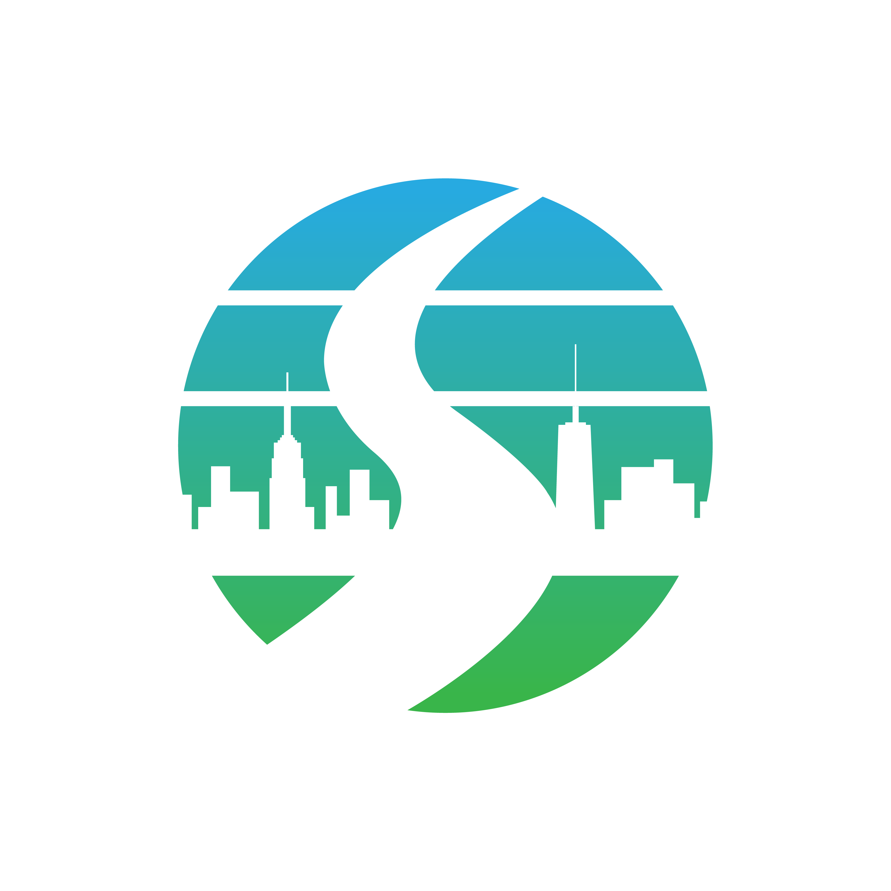


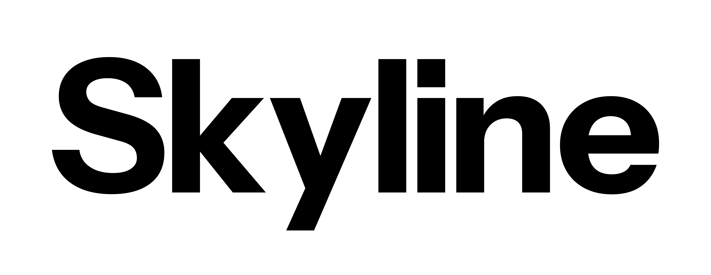

<div align="center">

<picture>
  <source media="(prefers-color-scheme: dark)" srcset="Skyline_Identity_Logo_Blue-Green_White.png">
  
</picture>

# Skyline Brand Kit

**Official logos, typefaces, and identity assets for Skyline Church NJ.**


</div>

---

## Contents

- [The Mark](#the-mark)
- [Logo Lockups](#logo-lockups)
- [Color](#color)
- [Typography](#typography)
- [Usage Guidelines](#usage-guidelines)
- [File Reference](#file-reference)
- [Contact](#contact)

---

## The Mark

<div align="center">
  
</div>

The Skyline logomark is a circle of horizontal bands, fading from sky blue at the top to green at the bottom. A city skyline sits in the middle of the circle, and a winding road cuts through it in the shape of an **S**.

---

## Logo Lockups

Three lockups are provided. Use the full logo wherever there is room, and the logomark alone where space is tight (social avatars, favicons, app icons).

| Lockup | Description | Best for |
| :--- | :--- | :--- |
| **Logo** | Logomark + wordmark, horizontal | Primary use: websites, print, signage |
| **Logomark** | Circle mark only | Avatars, favicons, stickers, small spaces |
| **Wordmark** | "Skyline" type only | Co-branding, tight horizontal layouts |

### Color variants

<table>
  <tr>
    <td align="center" bgcolor="#FFFFFF" width="33%">
      <br>
      <sub><b>Full color</b> · on light backgrounds</sub>
    </td>
    <td align="center" bgcolor="#111111" width="33%">
      <br>
      <sub><b>Full color</b> · on dark backgrounds</sub>
    </td>
    <td align="center" bgcolor="#FFFFFF" width="33%">
      <br>
      <sub><b>Black</b> · one-color print</sub>
    </td>
  </tr>
  <tr>
    <td align="center" bgcolor="#111111" width="33%">
      <br>
      <sub><b>White</b> · on dark or photo backgrounds</sub>
    </td>
    <td align="center" bgcolor="#FFFFFF" width="33%">
      <br>
      <sub><b>Logomark</b> · full color</sub>
    </td>
    <td align="center" bgcolor="#FFFFFF" width="33%">
      <br>
      <sub><b>Wordmark</b> · black</sub>
    </td>
  </tr>
</table>

---

## Color

The brand palette comes straight from the logomark's gradient. These hex values were sampled from the logo artwork, so check them against the master files before sending anything to a print vendor.

| Swatch | Name | Hex | Where it appears |
| :---: | :--- | :--- | :--- |
|  | **Sky Blue** | `#28AAE2` | Top of the logomark |
|  | **Teal** | `#2EAFAB` | Middle of the logomark |
|  | **Green** | `#3AB54A` | Bottom of the logomark |
|  | **Black** | `#000000` | Wordmark on light backgrounds |
|  | **White** | `#FFFFFF` | Wordmark on dark backgrounds |

**Brand gradient** (top → bottom): `#28AAE2` → `#2EAFAB` → `#3AB54A`

```css
background: linear-gradient(180deg, #28AAE2 0%, #2EAFAB 50%, #3AB54A 100%);
```

---

## Typography

Skyline uses two open-source families from [Instrument](https://fonts.google.com/?query=Instrument), both licensed under the SIL Open Font License.

| Role | Typeface | Package |
| :--- | :--- | :--- |
| **Sans-serif** (headlines, UI, body) | Instrument Sans | [`Instrument_Sans.zip`](Instrument_Sans.zip) |
| **Serif** (accents, pull quotes, editorial) | Instrument Serif | [`Instrument_Serif.zip`](Instrument_Serif.zip) |

**Instrument Sans** comes as variable fonts (width and weight axes) plus static cuts in Regular, Medium, SemiBold, and Bold, with italics. Condensed and SemiCondensed widths are included.

**Instrument Serif** comes in Regular and Italic.

### Installing the fonts

1. Unzip the package.
2. Install the `.ttf` files (double-click and choose *Install*, or drag them into Font Book / the Windows Fonts folder).
3. Restart any open design or office apps so they pick up the new fonts.

### On the web

```css
@import url("https://fonts.googleapis.com/css2?family=Instrument+Sans:ital,wght@0,400..700;1,400..700&family=Instrument+Serif:ital@0;1&display=swap");

body    { font-family: "Instrument Sans", system-ui, sans-serif; }
.accent { font-family: "Instrument Serif", Georgia, serif; }
```

---

## Usage Guidelines

**Do**

- Use the full-color logo on white or very light backgrounds.
- Use the white logo on dark backgrounds, or the full-color logo with the white wordmark.
- Use the black or white one-color versions when color printing isn't available.
- Leave clear space around the logo of at least the width of the "S" in the wordmark.
- Use the logomark alone when the logo would be too small to read.

**Don't**

- Stretch, squash, rotate, or skew the logo.
- Recolor the logo or change the gradient.
- Add shadows, outlines, or effects.
- Place the full-color logo on a busy photo or a background that clashes with the gradient.
- Rebuild the wordmark in another typeface.

---

## File Reference

### Logo (logomark + wordmark)

| File | Variant |
| :--- | :--- |
| `Skyline_Identity_Logo_Blue-Green_Black.png` / `.jpg` | Full color mark, black wordmark |
| `Skyline_Identity_Logo_Blue-Green_White.png` | Full color mark, white wordmark |
| `Skyline_Identity_Logo_Black.png` / `.jpg` | All black |
| `Skyline_Identity_Logo_White.png` | All white |
| `Skyline_Identity_Logo_Blue-Green.jpg` | Full color mark, black wordmark (JPG) |

### Logomark (circle only)

| File | Variant |
| :--- | :--- |
| `Skyline_Identity_Logomark_Blue-Green.png` / `.jpg` | Full color |
| `Skyline_Identity_Logomark_Black.png` / `.jpg` | Black |
| `Skyline_Identity_Logomark_White.png` | White |

### Wordmark (type only)

| File | Variant |
| :--- | :--- |
| `Skyline_Identity_Wordmark_Black.png` / `.jpg` | Black |
| `Skyline_Identity_Wordmark_White.png` | White |

### Fonts

| File | Contents |
| :--- | :--- |
| `Instrument_Sans.zip` | Variable and static TTFs, plus OFL license |
| `Instrument_Serif.zip` | Regular and Italic TTFs, plus OFL license |

> **Which format?** PNG files are transparent, so use them on top of colors, photos, and video. JPGs have a solid white background and are best for quick pasting into documents. The PNGs are very high resolution (up to 11,729 px wide), so they hold up for large-format print.

---

## Contact

Questions about the brand, or need a file that isn't here? Reach out to the Skyline Church NJ team.

<div align="center">
<sub>© Skyline Church NJ. Logos and identity assets are for approved use only. Instrument Sans and Instrument Serif are licensed under the <a href="https://openfontlicense.org">SIL Open Font License</a>.</sub>
</div>
